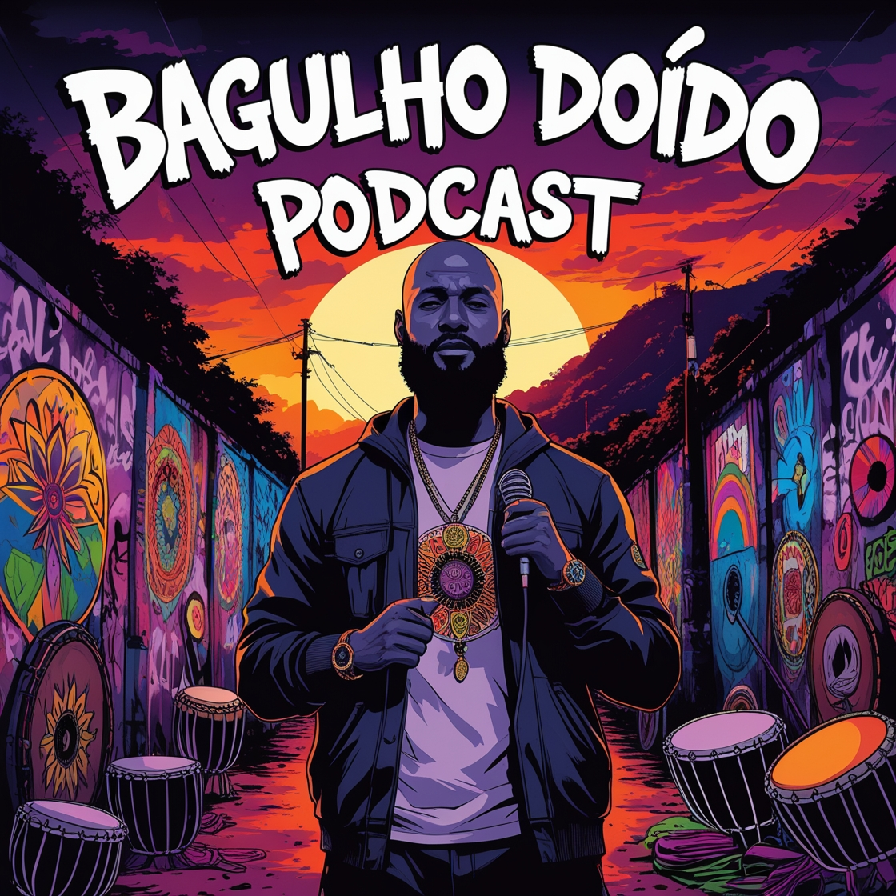

podcast preview

[BAGULHO DOIDO PODCAST - EPISODE 01](https://soundcloud.com/heitor-ribeiro-446662419/bagulho_doido_episode_01)

    <audio src="output/podcast_editado.MP3" controls title="Podcast editado"></audio>

# Projeto Podcast Gerado por I.A.s

 > ℹ️ **NOTE:** Este é o repositório desenvolvido durante o Bootcamp Microsoft 50 Anos - Prompts Inteligentes em parceria com a [DIO](https://dio.me)

Projeto com o objetivo de gerar um podcast utilizando ferramentas de IA através de prompts mais trabalhado.

Utilizei uma esteira de prompts para gerar cada etapa do processo criativo.

## 💻 Tecnologias utilizadas no projeto

- [ChatGPT](https://chat.openai.com/) 
- [Leonardo](https://app.leonardo.ai/)
- [Clipchamp](https://app.clipchamp.com/)
- [Audio Extractor](https://audio-extractor.net/)

## ✨ Como foi feito ?

- Roteiro gerado via chatgpt
- Vídeo com audio já tratado, gerado no Clipchamp
- Leonardo Para gerar capas
- Audio Extractor para extrair audio do vídeo

Utilize os prompts dentro do link do `Notion` fornecido na parte de `Materiais` para criar um podcast de maneira automatizada

## 📚 Materiais

- [Notion Template](https://helpful-jump-17b.notion.site/PAS-Podcast-AI-Studio-210489e15d7a4a73b743bb159e45d06f?pvs=4)

---

Feito por [♟️ Heitor Ribeiro](https://github.com/riberorap)
